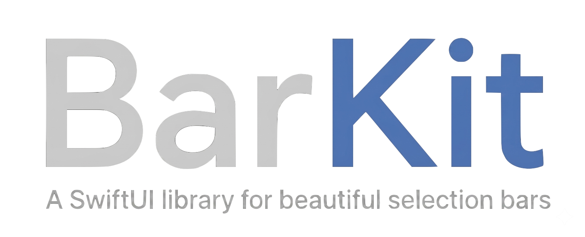
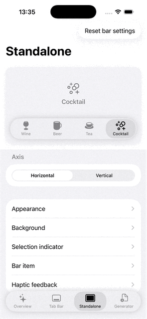
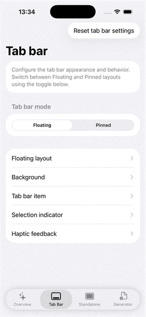

# BarKit

Customizable SwiftUI bar with selectable items.



## Features

- **Simple by default, powerful when needed** — sensible defaults with full configuration depth
- **Flexible layout** — horizontal and vertical axis, spacing, alignment, and size class adaptation
- **Tab bar support** — `FloatingTabBarView` and `PinnedTabBarView` as ready-to-use wrappers
- **Flexible backgrounds** — solid color, system materials, or custom shader blur
- **Selection indicator** — animated, draggable, fully customizable
- **Metal shader effects** — lens distortion and chromatic aberration at the indicator boundary
- **Per-item styling** — colors, icon size, text style, and padding per item style
- **Animations** — named presets or any custom SwiftUI animation
- **Haptic feedback** — selection, impact, success, warning, and error styles (iOS 17+)
- **Accessibility** — VoiceOver labels and sort priority built in
- **Interactive Example App** — explore every setting live and generate ready-to-use initializer code

## Requirements

- iOS 16+
- Swift 6
- Xcode 16+

## Installation

### Swift Package Manager

In Xcode: **File → Add Package Dependencies**

Enter the repository URL:
https://github.com/MaksimG82/BarKit

Or add directly to `Package.swift`:

```swift
dependencies: [
    .package(url: "https://github.com/MaksimG82/BarKit", from: "1.0.0")
]
```
## Quick Start

### Define your items

```swift
struct MyItem: BarItemProtocol {
    let title: String
    let icon: BarIcon
    var style: BarItemStyle = .regular
    var id: AnyHashable { title }
}
```

### Standalone BarView

```swift
@State private var selected = items[0]

let items: [MyItem] = [
    MyItem(title: "Wine",     icon: .system("wineglass.fill")),
    MyItem(title: "Beer",     icon: .system("mug.fill")),
    MyItem(title: "Tea",      icon: .system("cup.and.saucer.fill")),
    MyItem(title: "Cocktail", icon: .system("bubbles.and.sparkles")),
]

BarView(items: items, selected: $selected)
// Vertical layout:
BarView(items: items, selected: $selected, configuration: .init(axis: .vertical))
```



### Floating tab bar

```swift
@State private var selected = items[0]

let items: [MyItem] = [
    MyItem(title: "Overview",  icon: .system("sparkles")),
    MyItem(title: "Tab Bar",   icon: .system("dock.rectangle")),
    MyItem(title: "Standalone",icon: .system("rectangle.inset.filled")),
    MyItem(title: "Generator", icon: .system("doc.badge.gearshape")),
]

ZStack(alignment: .bottom) {
    ContentView()
    FloatingTabBarView(items: items, selected: $selected)
}
.ignoresSafeArea(.all, edges: .bottom)
```

### Pinned tab bar

```swift
VStack(spacing: 0) {
    ContentView()
    PinnedTabBarView(items: items, selected: $selected)
}
```



## Documentation

Full documentation is available at [maksimg82.github.io/BarKit](https://maksimg82.github.io/BarKit/documentation/barkit)
